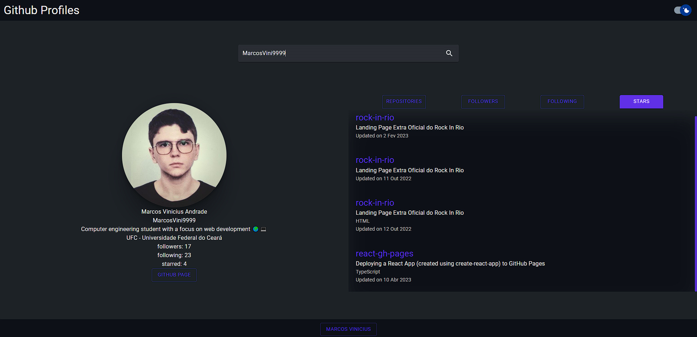

# Github Profile

## 📚 Description

- The project uses the github api to search for a user on github according to the user's nickname, and displays the user's information, such as repositories, followers, followings and starred repositories.

## 🛠️ Technologies

- React + TypeScript
- Material UI
- Vite
- Axios
- Github API

## ❓ How to Install and Run the Project

- To clone the repository type the following command in the terminal in the location you want:

```
git clone https://github.com/MarcosVini9999/github-profile.git
```

- Enter the following command to install the dependencies:

```
npm i
```

- Enter the following command to run the script and start the project:

```
npm run dev
```

## 🐱‍💻 Examples



